

  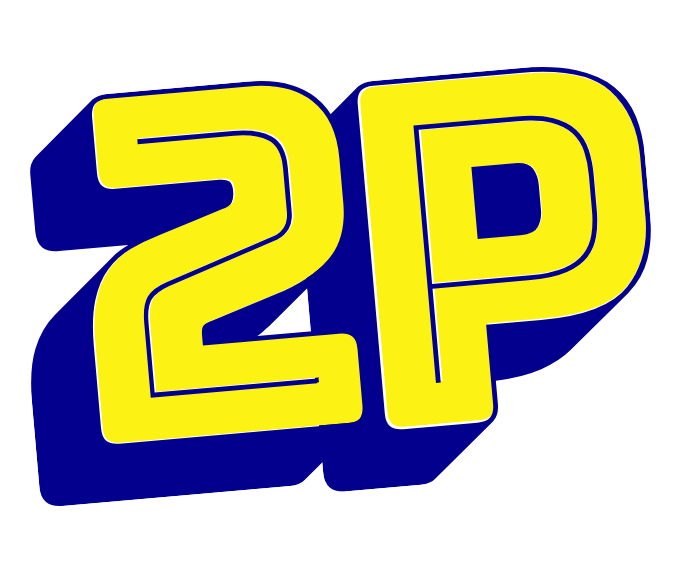

<h2 align="center" style="font-weight: 500">추억의 이인용 오락실 게임을 
 온라인으로 즐기자!</h2>

배포링크 -
  <a href="http://project-2p.s3-website.ap-northeast-2.amazonaws.com/">
    2P(이인용) 
  </a>

 

학창시절 쉬는 시간마다 공책을 찢어서 즐겼던 숫자야구게임, 수업을 마치고 오락실에 달려가서 친구들과 했던 게임 등 추억을 되살려서 친구와 함께 온라인으로 즐겨보세요. "이인용"은 쉽고 간단한 게임을 온라인으로 즐길 수 있는 서비스입니다.
 

  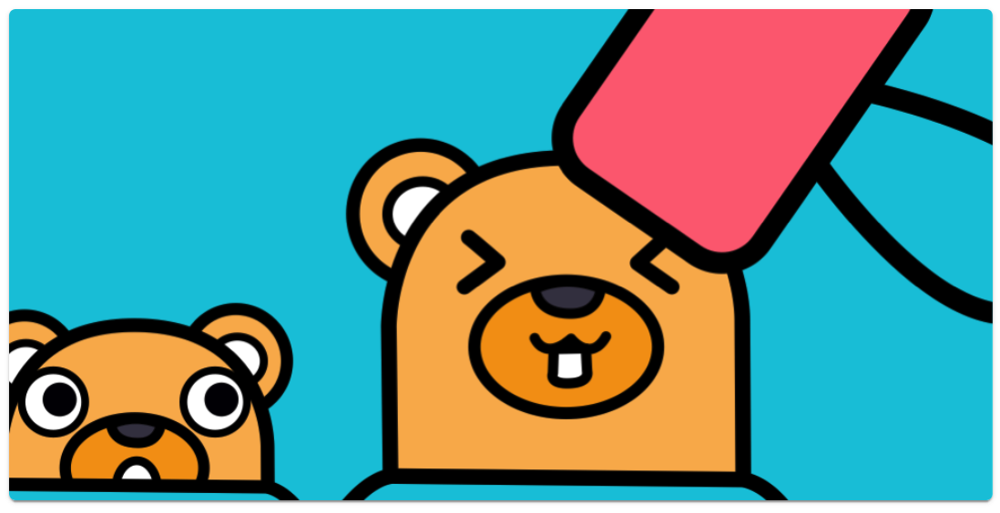
  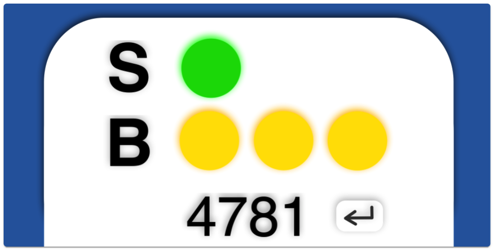
  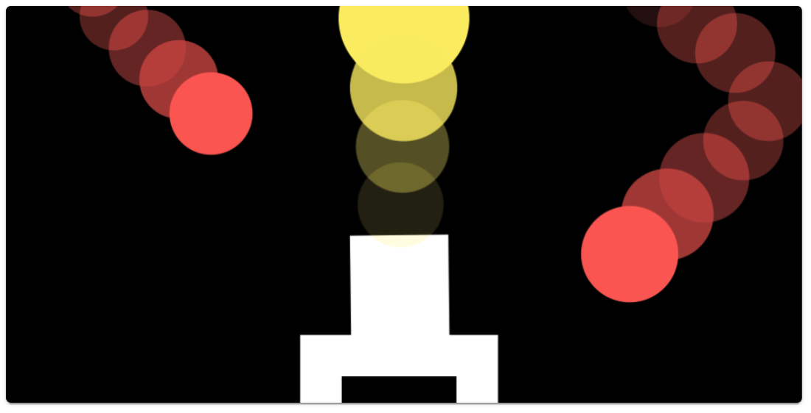

 
 

# Updates

  
20.09.03 연습하기(컴퓨터 모드) 기능추가

  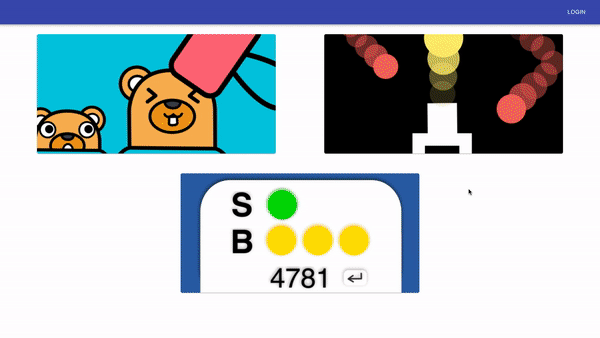

 

# Skills

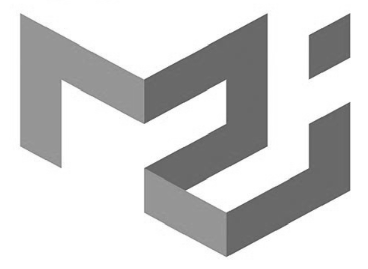

 

# Demos

  
두더지 잡기

  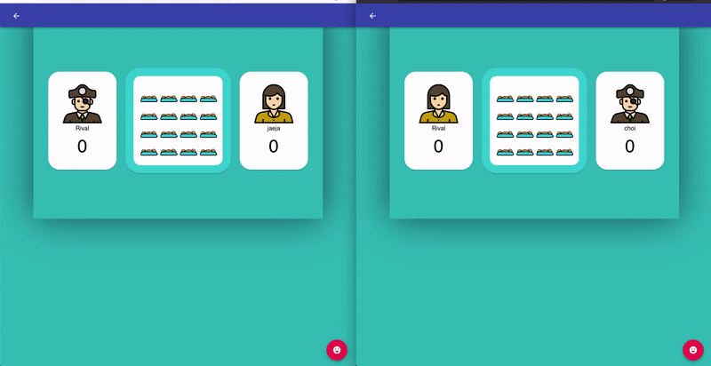

  
숫자 야구

  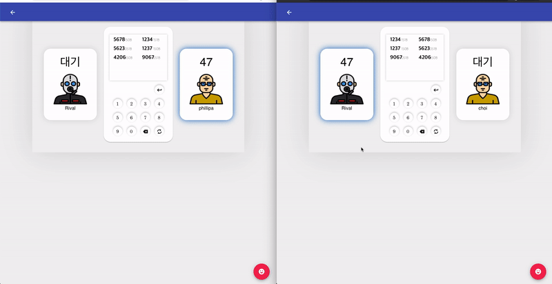

  
구슬 동자

  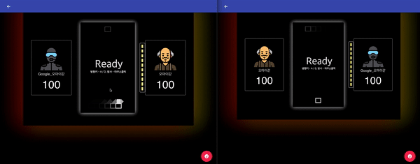

 

# Flows

### Work Flow

  
와이어 프레임

  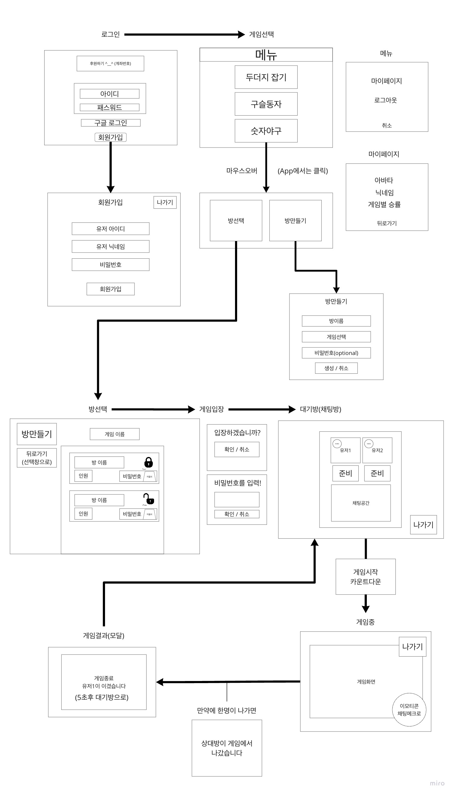

  
데이터 플로우

  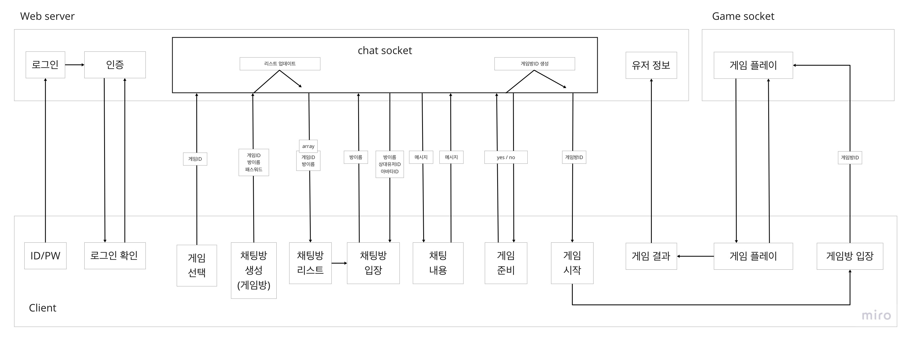

### Game Flow

두더지 잡기

  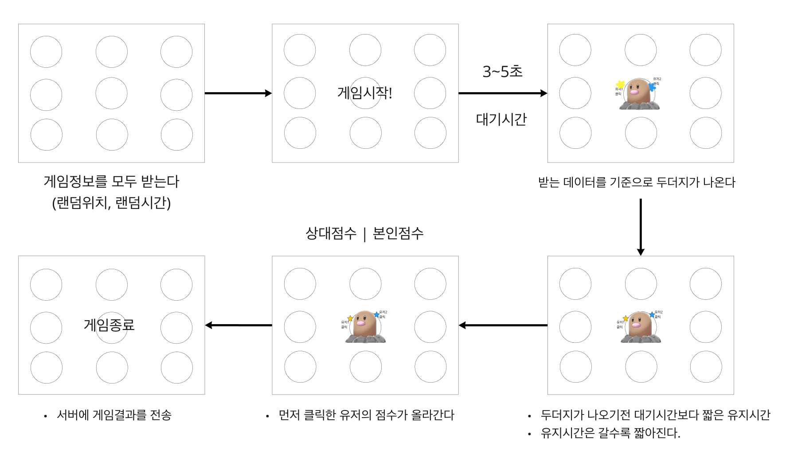

숫자 야구

  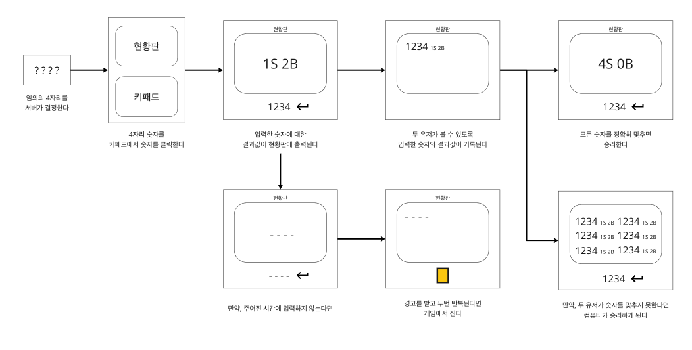

구슬 동자

  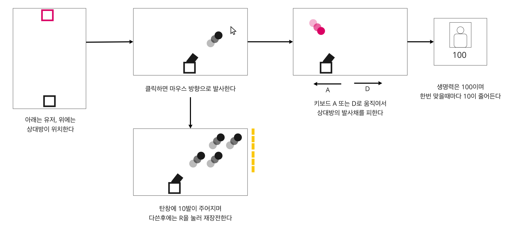

 

